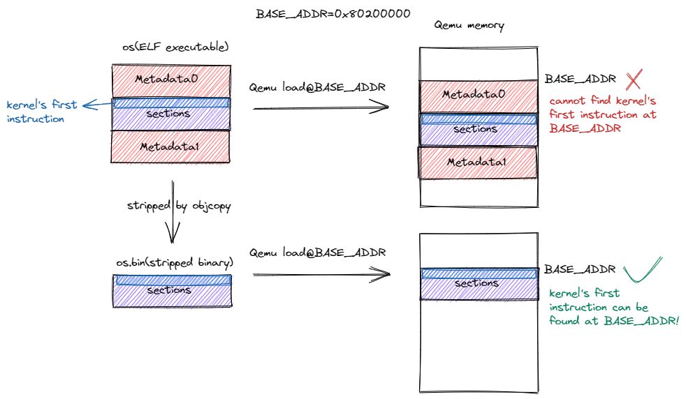

# 应用程序和基本执行环境

# qemu

## qemu加载的三个阶段

- Qemu的程序从0x1000跳到0x80,000,000
- bootloader 在0x80,000,000对应的物理内存上，开始执行引导。最后跳到和操作系统约定好的内存地址上。
- 操作系统开始运行

## 真实计算机的三个阶段

- 加电后，PC寄存器设定为ROM的地址，然后CPU执行ROM的软件（固件）。跳转到引导
- 引导完成一些初始化工作，最后跳转到适当地址将控制权转移给操作系统。
- 操作系统运行

## 程序的基本知识

### 编译流程

- 编译器：转成汇编语言
- 汇编器：转成目标文件
- 链接器： 目标文件和外部目标文件拼在一起

# 如何完成引导

## 编写linker script

我们主要需要做的是完成内存的映射。

在config里设置好linker script的文件位置。

```bash
OUTPUT_ARCH(riscv)
ENTRY(_start)
BASE_ADDRESS = 0x80200000;

SECTIONS
{
    . = BASE_ADDRESS;
    skernel = .;

    stext = .;
    .text : {
        *(.text.entry)
        *(.text .text.*)
    }

    . = ALIGN(4K);
    etext = .;
    srodata = .;
    .rodata : {
        *(.rodata .rodata.*)
        *(.srodata .srodata.*)
    }

    . = ALIGN(4K);
    erodata = .;
    sdata = .;
    .data : {
        *(.data .data.*)
        *(.sdata .sdata.*)
    }

    . = ALIGN(4K);
    edata = .;
    .bss : {
        *(.bss.stack)
        sbss = .;
        *(.bss .bss.*)
        *(.sbss .sbss.*)
    }

    . = ALIGN(4K);
    ebss = .;
    ekernel = .;

    /DISCARD/ : {
        *(.eh_frame)
    }
}
```

官方提供的这段链接文件的主要作用是映射.text，.rodata,.data。

主体部分是段名 `段:{需要合并的的目标段}`

里面的目标段也是可以用通配符的

具体说明，.text段有两个子段，前面那个是所有文件的`.text.entry` ，接着是`.text` 和`.text.*` 的段。

## 手动加载内核可执行文件


这样编译出来的文件还不能用。因为带着一些元数据。我们需要手动裁剪一下

# 函数调用的实现

- 了解一下寄存器的Calling Convention



- 给我们的程序分配一个栈

```nasm
.section .text.entry
    .globl _start         # 让ld能看到_start符号
_start:
    la sp, boot_stack_top # 把boot_stack_top的地址放进sp里面，作为我们的栈指针
    call rust_main        # 转到rust_main

    .section .bss.stack   # 在bss这边放个stack
    .globl boot_stack     
boot_stack:
    .space 4096 * 16      # 分配空间
    .globl boot_stack_top 
boot_stack_top:
```

- 因为放到bss区，根据convention需要做一下置0操作。我尝试不清0似乎也可以。

这里`no_mangle` 表示禁止rust对函数名进行修改，防止我们的汇编跳转不过来。

`extern "C"` 表示引用一个外部的C函数接口。这里就是找我们之前在汇编里面放的接口。

后面那行从sbss到ebss把内存上数据置为0。

```rust
#[no_mangle]
pub fn rust_main() -> ! {
    clear_bss();
    loop {}
}
fn clear_bss(){
    extern "C"{
        fn sbss();
        fn ebss();
    }
    (sbss as usize..ebss as usize).for_each(|a| {
        unsafe { (a as *mut u8).write_volatile(0) }
    });
}
```

# 问答题

## 10

### 题目

现代的很多编译器生成的代码，默认情况下不再严格保存/恢复栈帧指针。在这个情况下，我们只要编译器提供足够的信息，也可以完成对调用栈的恢复。

我们可以手动阅读汇编代码和栈上的数据，体验一下这个过程。例如，对如下两个互相递归调用的函数：

```rust
void flip(unsigned n) {
    if ((n & 1) == 0) {
        flip(n >> 1);
    } else if ((n & 1) == 1) {
        flap(n >> 1);
    }
}

void flap(unsigned n) {
    if ((n & 1) == 0) {
        flip(n >> 1);
    } else if ((n & 1) == 1) {
        flap(n >> 1);
    }
}
```

在某种编译环境下，编译器产生的代码不包括保存和恢复栈帧指针 `fp`
 的代码。以下是 GDB 输出的本次运行的时候，这两个函数所在的地址和对应地址指令的反汇编，为了方便阅读节选了重要的控制流和栈操作（省略部分不含栈操作）：

```rust
(gdb) disassemble flap
Dump of assembler code for function flap:
   0x0000000000010730 <+0>:     addi    sp,sp,-16    // 唯一入口
   0x0000000000010732 <+2>:     sd      ra,8(sp)
   ...
   0x0000000000010742 <+18>:    ld      ra,8(sp)
   0x0000000000010744 <+20>:    addi    sp,sp,16
   0x0000000000010746 <+22>:    ret                  // 唯一出口
   ...
   0x0000000000010750 <+32>:    j       0x10742 <flap+18>

(gdb) disassemble flip
Dump of assembler code for function flip:
   0x0000000000010752 <+0>:     addi    sp,sp,-16    // 唯一入口
   0x0000000000010754 <+2>:     sd      ra,8(sp)
   ...
   0x0000000000010764 <+18>:    ld      ra,8(sp)
   0x0000000000010766 <+20>:    addi    sp,sp,16
   0x0000000000010768 <+22>:    ret                  // 唯一出口
   ...
   0x0000000000010772 <+32>:    j       0x10764 <flip+18>
End of assembler dump.
```

启动这个程序，在运行的时候的某个状态将其打断。此时的 `pc`, `sp`, `ra`寄存器的值如下所示。此外，下面还给出了栈顶的部分内容。（为阅读方便，栈上的一些未初始化的垃圾数据用 `???`代替。）

### 我的想法

`sp` 是栈的指针，`ra` 是返回地址。函数每次开始的时候，开了16字节，但是显然这里没有保存之前fp的代码了，而只有保存返回地址的代码。

要还原之前的调用栈信息，只需要知道它们的栈帧的指针位置。

320-310这段是本层的栈帧，将其+16就是上一层的栈帧位置。

# logging的实现

要求实现一个带彩色的logging。这里因为不太熟悉Rust，我一直在想怎么设置一个全局的静态变量保存Level，后面发现可以参考rCore的实现。于是我参考着[rCore](https://github.com/rcore-os/virtio-drivers)上面的实现抄了一下。

std里面的log库是用不了的，这里rCore找了一个[log](https://docs.rs/log/latest/log/)的第三方crate。

这个log库用起来挺方便的，对于自定义的Logger，只需要实现Log Trait即可。除此以外，还需要初始化一下Logger。这里初始化部分就是set了一下logger，然后根据环境变量设定了max_level。

```rust
// logging.rs
struct SimpleLogger;
impl Log for SimpleLogger{
    fn enabled(&self, _metadata: &Metadata) -> bool {
        metadata.level()  <= log::max_level() // 这个库内部level err=1,warn=2,因此是小于
    }
    fn log(&self, record: &Record) {
        println!("test");
        if self.enabled(record.metadata()) {
            print_in_color(
                format_args!(
                    "[{:>5}] {}\n",
                    record.level(),
                    record.args()
                ),
                level_to_color_code(record.level()),
            );
        }
    }
    fn flush(&self) {}
}

// 初始化
static LOGGER: SimpleLogger = SimpleLogger;
pub fn init(){
  log::set_logger(&LOGGER).unwrap();
	log::set_max_level(match option_env!("LOG") {
        Some("error") => LevelFilter::Error,
        Some("warn") => LevelFilter::Warn,
        Some("info") => LevelFilter::Info,
        Some("debug") => LevelFilter::Debug,
        Some("trace") => LevelFilter::Trace,
        _ => LevelFilter::Off,
    });
}
```

`print_in_color` 是一个函数，由一个颜色转换函数，一个把颜色格式化符号放在首尾的宏组成

```rust
// logging.rs
fn level_to_color_code(level: Level) -> u8 {
    match level {
        Level::Error => 31, // Red
        Level::Warn => 93,  // BrightYellow
        Level::Info => 34,  // Blue
        Level::Debug => 32, // Green
        Level::Trace => 90, // BrightBlack
    }
}
macro_rules! with_color {
    ($args: ident, $color_code: ident) => {{
        format_args!("\u{1B}[{}m{}\u{1B}[0m", $color_code as u8, $args)
    }};
}
fn print_in_color(args: fmt::Arguments, color_code: u8) {
    Stdout.write_fmt(with_color!(args, color_code)).unwrap();
}
```

因为基本是抄的，改起来并不麻烦。主要问题是中间遇到了一堆引用mod,crate的问题。

在main中使用的时候，直接用`log::info!()` 就行了。

教程帮我们写好了extern部分了，把println! 改了就行了。

```rust
use log::{info}; 
mod logging;
// .... 
pub fn rust_main() -> ! {
		extern "C" {
        fn stext(); // begin addr of text segment
        fn etext(); // end addr of text segment
        fn srodata(); // start addr of Read-Only data segment
        fn erodata(); // end addr of Read-Only data ssegment
        fn sdata(); // start addr of data segment
        fn edata(); // end addr of data segment
        fn sbss(); // start addr of BSS segment
        fn ebss(); // end addr of BSS segment
        fn boot_stack(); // stack bottom
        fn boot_stack_top(); // stack top
    }
		clear_bss();
		init();
    info!("HELLO WORLD");
    warn!("HELLO WORLD");
    error!("HELLO WORLD");

    info!(".text [{:#x}, {:#x})", stext as usize, etext as usize);
    info!(".rodata [{:#x}, {:#x})", srodata as usize, erodata as usize);
    info!(".data [{:#x}, {:#x})", sdata as usize, edata as usize);
    info!(
        "boot_stack [{:#x}, {:#x})",
        boot_stack as usize, boot_stack_top as usize
    );
    info!(".bss [{:#x}, {:#x})", sbss as usize, ebss as usize);
}
```

这样就完成了。

## CPU id的获取

这里还要求获取CPU id，看下rCore和xv6都是通过`"mv $0 tp" : "=r"(id));` 获取的。但是这个格式要llvm_asm才能用，我这里改成了asm宏的格式：

```rust
// cpu.rs
use core::arch::asm;
pub fn cpu_id() -> usize {
	let id;
	unsafe{
		asm!("mv {0}, x4",
			out(reg) id
		);
	}
	id
}

// logging.rs
print_in_color(
                format_args!(
                    "[{:>5}] [{},-] {}\n",
                    record.level(),
                    cpu_id(), // 添加CPU id
                    record.args()
                ),
                level_to_color_code(record.level()),
            );
```
